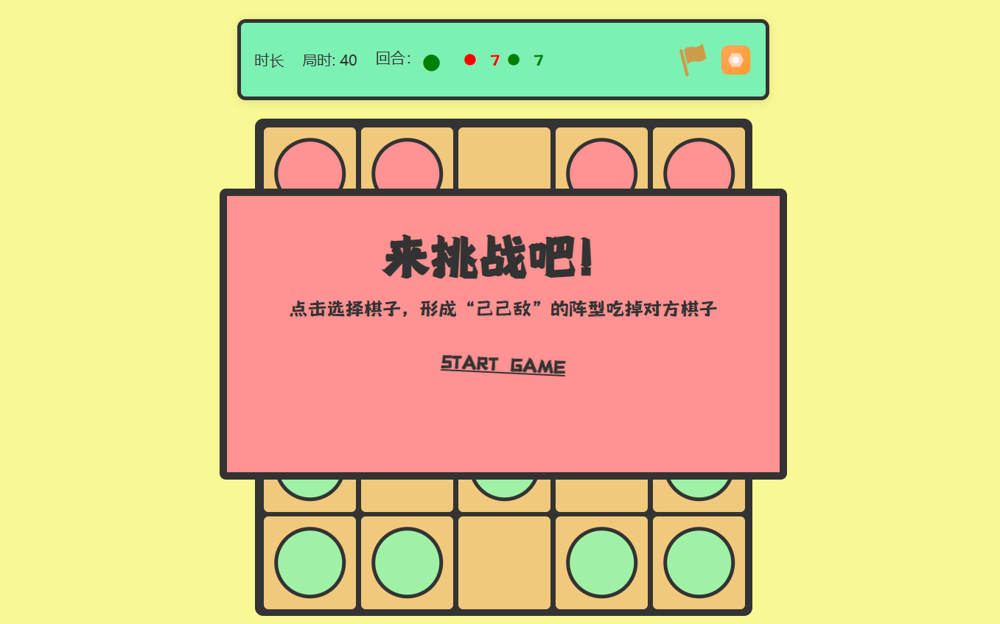
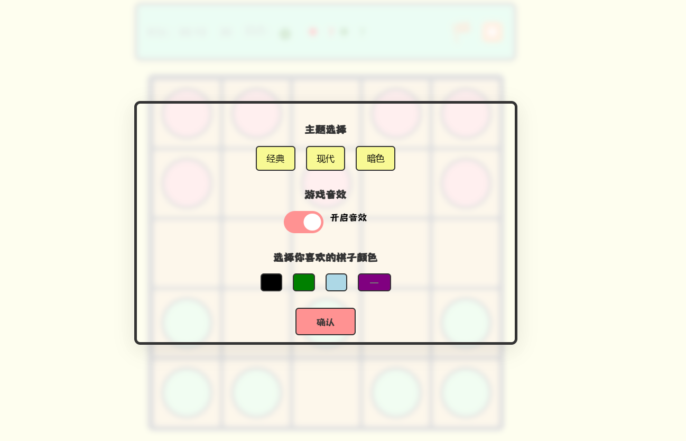
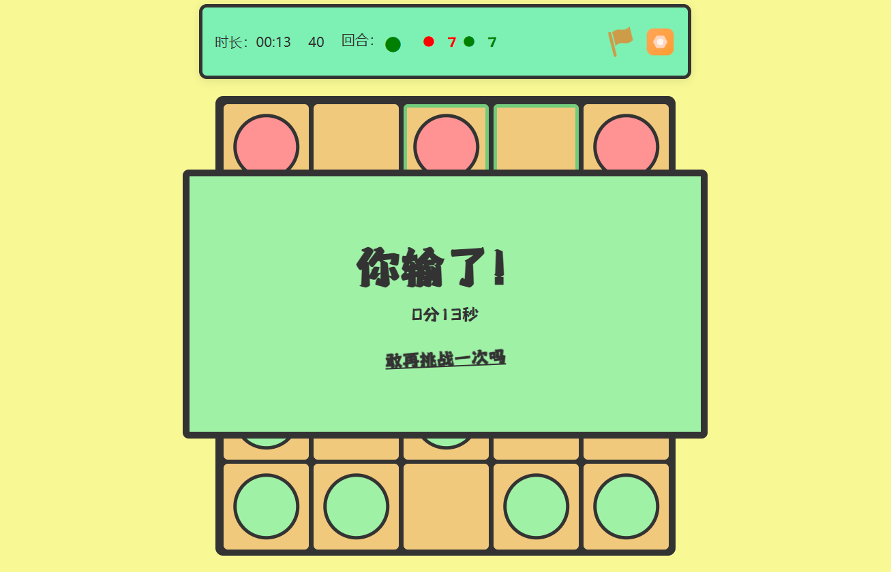

## 游戏概览

这是一个双人对战的棋类游戏，玩家通过移动棋子并吃掉对方棋子来获胜。

游戏由民间的棋类游戏“六门儿”改编而成。在这个游戏基础上，我增加了格子的数量和棋子的数量，改变了开局摆放位置，使得移动棋子更加轻松、灵活，增加了趣味性和挑战性。

## 游戏截图

*进入游戏后的初始界面*

*游戏设置*

*玩家投降*

## 棋盘和初始布局

1. 棋盘为5x5的方格，共25个位置。
2. 每个玩家有7个棋子。
3. 玩家A（上方）的初始位置：1、2、4、5、6、8、10
4. 玩家B（下方）的初始位置：21、22、24、25、16、20、18

## 游戏规则

-棋子摆放：每名玩家将自己的棋子摆放在棋盘的两边，具体位置可以根据玩家约定或传统规则确定。
-棋子移动：每个棋子可以向相邻的格子移动，但不能跳过其他棋子。某些版本中，棋子可能有特殊的移动规则或能力。
-吃子规则：如果一个玩家的棋子可以移动到对方棋子所在的格子，那么对方的棋子将被吃掉并移出棋盘。
-胜利条件：通常是将对方的棋子全部吃掉，或某一方投降认输。

## 策略提示

- 尽量保持自己的棋子连接，形成防御阵型。
- 注意观察对方的棋子分布，寻找机会形成吃子局面。
- 控制中心位置可以增加移动的灵活性。

## AI算法

AI算法使用的是迭代加深(Iterative Deepening)和 Alpha-Beta 剪枝，对于这样一个不太复杂的游戏，这个算法就足够了。

后续考虑实现其他的算法：

- 蒙特卡洛树搜索(Monte Carlo Tree Search, MCTS)
- 模拟退火算法(Simulated Annealing, SA)
- AlphaZero风格的深度学习模型

## TODoList

- 实现联机对局，允许两个玩家同时进行游戏。
- 上架多平台版本，支持PC、移动端、Web等多个平台。
